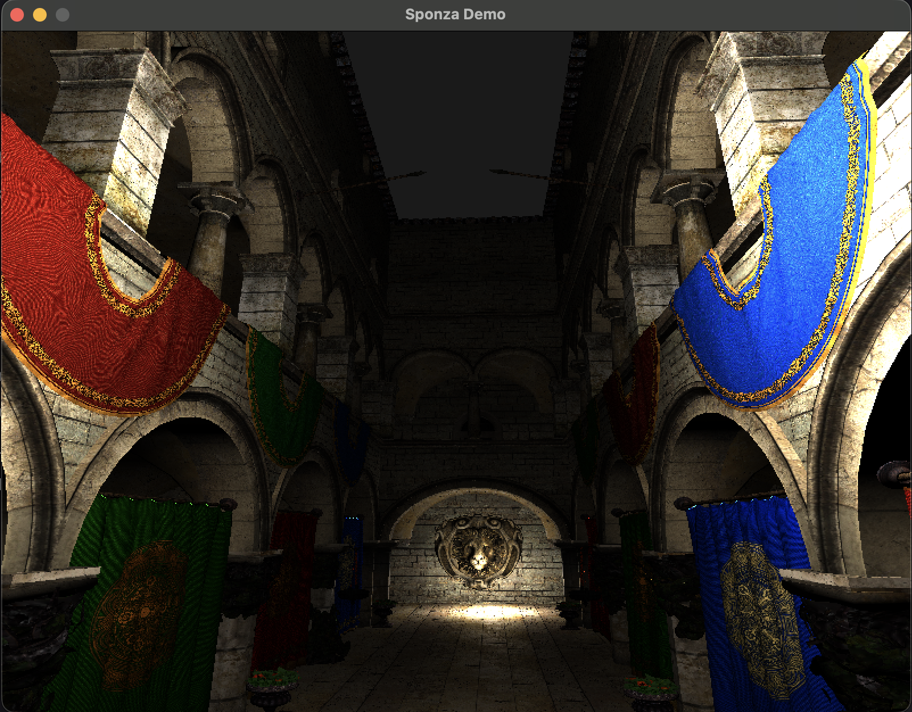

# XEV - Xarlie's Express Visualization
A Graphics Engine for Building Games, Visualizations, and Interactive Arts.

```
Licensed under Apache 2.0
Copyright © Nguyen Minh Hieu, 2026
```

AI Usage Disclaimer: AI is strictly forbidden. All code are written, designed,
and maintained by Charlie.

1. Installation

You can build the example app with:
```
git clone --recursive git@gitlab.com:hieuristics/xev.git
cmake -B build -DMAKE_DEMO=ON && cmake --build build -j8 && ./build/demo/bin/demo
```
And you should see the following image



2. Features

 - headless renderering
 - clustered forward renderer
 - bindless descriptor set, dynamic rendering
 - virtual file system support archival format or loose files
 - support animations
 - MSDF font rendering
 - intermediate mode UI system

3. Note
 - Local object frame uses right-handed RDF system (+x - Right, +y - Down, +z - Front).
